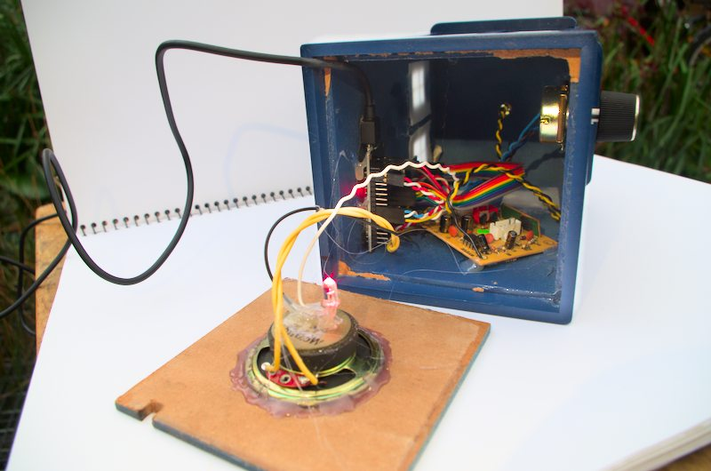
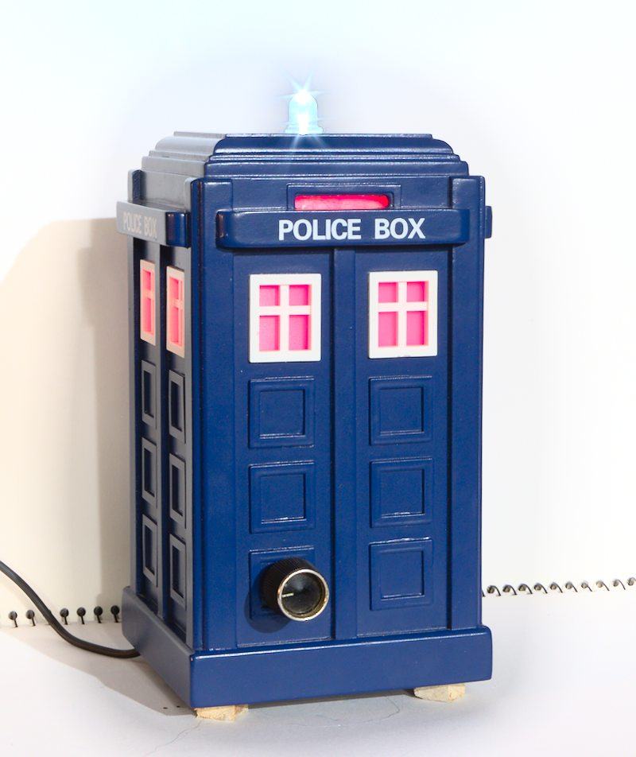

# Base station for connecting remote sensors to Thingsboard.
Remote sensors use [PJON over LoRa](https://github.com/gioblu/PJON) radio to communicate.
The [Thingsboard Gateway MQTT API](https://thingsboard.io/docs/reference/gateway-mqtt-api/) is used to connect on the Thingsboard side.

See [here](https://github.com/jgOhYeah/Farm-PJON-LoRa-network) for other sensors and more information on the system.

Written by Jotham Gates
August 2023

## Photos
<!-- 
 -->

## Getting started
The Github repository containing all design files and code is [here](https://github.com/jgOhYeah/FarmBaseStation).

1. Install Platform IO.
2. Open the project in the [`BaseStationCode`](./BaseStationCode/) directory.
3. Create a copy of [`BaseStationCode/src/credentials.example.h`](./BaseStationCode/src/credentials.example.h) and name this `credentials.h`. Fill out the settings in this file for the WiFi network to connect to,
MQTT broker, Thingsboard credentials and Over The Air (OTA) update settings.
1. Upload the code to the ESP32.
2. Assemble the electronics as shown in the schematics and optionally place inside a case.
3. Test with other sensors and the Thingsboard server.

## Updating using OTA updates
Over the air (OTA) updates can be used to update the software on the base station once it has been programmed for the first time. To do this:
1. Create a copy of [`BaseStationCode/credentials.example.ini`](./BaseStationCode/credentials.example.ini) and name this `credentials.ini`. 
2. Edit the upload port and auth flags to match those given in `credentials.h`.
3. Change the active Platform IO environment to `Tardis-OTA` from its default `Tardis` environment.
4. Compile and upload code as normal.

## Schematics
The base station uses an ESP32 development board as its base. An SX1278 LoRa radio module breakout board is connected via jumper leads. LEDs are soldered along with their respective current limiting resistors to wires that can be plugged into the ESP32 board. An audio amplifier and speaker can also be connected for alarm functionality. I salvaged this from the sound effects module of a broken children's ride on toy car.

## Fun part / experiments
I originally planned to use the build in DAC of the ESP32 to play sounds on alarm conditions. At this point I haven't succeded in this (currently using the [TunePlayer](https://github.com/jgOhYeah/TunePlayer) library to play simple monotonic songs instead). I did come across the [ESP32-A2DP](https://github.com/pschatzmann/ESP32-A2DP) library that allows the use of this unit as a terrible sounding bluetooth speaker.

[This sketch](Fun/BluetoothSpeaker/BluetoothSpeaker.ino) is the `bt_music_receiver_to_internal_dac` example from the ESP32-A2DP library with the addition of flashing lights.